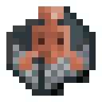

  

<h2 align="center">Code of Copper</h2>

Code of Copper is a lore heavy, and technically advanced Datapack. Adding a programmable Copper Golem into the game.

Throughout the world, different structures will generate, containing lore, and examples of programs that the Copper Golem can run. Programs can be written into a book, and then given to the Golem, by right clicking it with the book.

Right-clicking the Golem with an empty hand will execute it's current program.

While we recommend playing through the pack, as an addition to your world, and slowly discovering the language and features over time, if you would like a quick demo of the pack, you can use `/place template bot:demo` to place our demo structure.

**A datapack by Moxvallix, Gears and Wulfian. Enjoy!**  
[**Explore the docs »**](https://datapack.dev/docs/code_of_copper)  
[Report Bug](https://github.com/GMDU/code-of-copper/issues)

---

## Requirements
- **This datapack will only work in versions 1.20 and higher**
- **Make sure to remember to download and install the resource pack**
- **This datapack will not work without the following datapack libraries:**
  - [Moxlib](https://modrinth.com/datapack/moxlib)
  - [Regex Lib](https://modrinth.com/datapack/regex)

## Installation
To install the datapack, first download the latest release from [Modrinth](https://modrinth.com/datapack/code-of-copper).  
You will also need [Moxlib](https://modrinth.com/datapack/moxlib), and if you want Regular Expression support, [Regex](https://modrinth.com/datapack/regex).

Put these in the `datapacks` folder of your world. For more information, see the [Minecraft wiki](https://minecraft.wiki/Tutorials/Installing_a_data_pack).

When you install the datapack, you must leave and rejoin the world (or restart the server) for all effects to properly take place.

## Obtaining a Copper Golem
Golems are found in airships, which generate naturally throughout your world when you have the datapack installed. Make sure to keep your render distance up, they spawn around 200 blocks in the air!

Looking for shadows on the ground is a great way to locate airships.  
Each airship contains one copper golem, alongside three example programs to help you get started with GolemScript.

If you would like to follow along with the datapack and learn the language as you go, stop reading here. 

## Getting started with GolemScript
GolemScript is written in Minecraft books, which are applied to the golem to give it a program.  
See [our documentation](https://datapack.dev/docs/code_of_copper) for more information.

## License
This project is distributed under the GPL-3.0 License. See `LICENSE.md` for more information.

## Discord Server
You can join our discord server [here](https://discord.gg/2eR2hdYJMc).

## Oxidisation and progression
After a certain number of instruction executions, the golem will begin to oxidise.

Interacting with the golem while holding an axe removes the rust.

If the golem is fully oxidised, it will not run anymore, but upon scraping it with an axe you will find example programs that explain the language of GolemScript.

This process can be avoided however, by waxing the golem. As with anything copper, you can also scrape off the wax.
